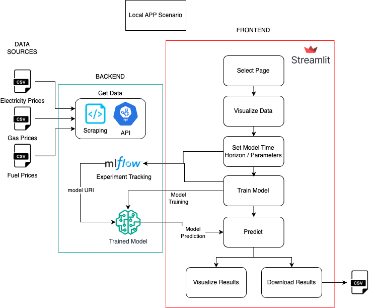

# Energy Prices Monitoring ITA  

## Project Description
Streamlit Application built for monitoring energy prices in Italy across time.  
Italy is not self-sufficient in terms of energy provisioning, but many of its companies are energy-intensive and need to look very carefully at their electricity bill, as well as their transportation/delivery costs; their heating/air conditioning needs and prices associated with them are also not to be underestimated in a period of economic crisis.  
  
This Demo aims to showcase prices for a list of commodities, as well as a Machine Learning model to forecast their evolution; please note that forecast results are NOT a guarantee that market prices will eventually exactly turn out that way, and are only presented as orientative values.

## Data Collection
Data for this application are downloaded from a variety of sources; they include
* ⛽️ **Fuel prices** from [Ministero dell'Ambiente e della Sicurezza Energetica](https://dgsaie.mise.gov.it/open-data);
* ⚡️ **Electricity prices** from [GME](https://www.mercatoelettrico.org/it/)
* 🔥 **Gas Prices** from the [TTF index](https://www.enel.it/en/supporto/faq/ttf-gas), obtained through the [Yahoo Finance API](https://pypi.org/project/yfinance/).

## Forecasting Algoryhtm(s)
Forecasting for all utilities/fuels is done via [**Prophet** algorithm](https://facebook.github.io/prophet/):
* the default algorithm is the `Prophet` model developed by Meta;
* model training is monitored and tracked using [**MLflow**](https://mlflow.org/);

## Local Usage
To run the Streamlit App on your local environment go on your terminal:
1. install the **requirements**
```
    pip install -r requirements.txt.
```
2. **run**
```
    streamlit run Home.py
```
3. **experiment tracking** is done via mlflow. Once you launch an experiment (i.e. training a model) you can run 
```
    mlflow server
```
to visualize the mlflow UI and see all the experiment runs for all models, their metrics and so on.

